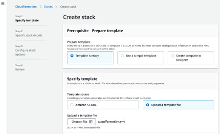
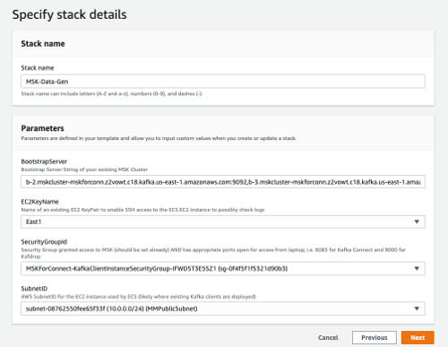
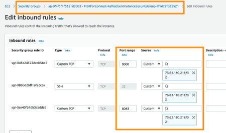
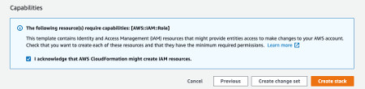
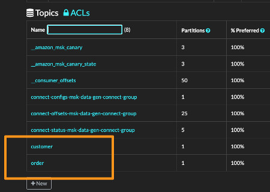

## How to Deploy MSK Data Generator in a Container running in ECS

### Overview
This example uses a publicly avaiable container and CloudFormation template to deploy MSK Data Generator and Kafdrop running in Elastic Container Service.

It requires an existing MSK cluster configured to allow access with no authentication and plain-text access (port 9092).

The CloudFormation template
is found in the [deploy](../deploy/) directory of this repo.  

Before running the CFN template, consider the following requirements.

### Requirements

You will need the following

* Bootstrap Server string of your existing MSK Cluster

* Existing Security Group ID with access to MSK Broker endpoints (minimum. more on this below)

* Subnet ID of where to deploy MSK Data Generator


Here's a walk-through example of one way to get started

1. From CloudFormation Console, Create Stack with upload of [../deploy/cloudformation.yml](../deploy/cloudformation.yml) file as shown and click Next  

    

2. Complete form according to your environment.  For example  

    * Stack Name: anything you want # Example below is "MSK-Data-Gen"

    * BootstrapServer: bootstrap server string of your cluster

    * EC2KeyName: existing EC2 pair in case you want to ssh to the ECS EC2 instance

    * SecurityGroupId: existing security group with access to MSK cluster AND ports 8083 and 9000 open.  More on this below.

    * SubnetID: where the ECS EC2 instance will be deployed; presumes access to MSK Cluster

    

    #### Note on `SecurityGroupId`

    At minimum, the specified Security Group should have access to MSK ports.  In addition, in this example, open access for
    ports 8083 (to configure MSK Data Generator from your environment) and 9000 (for Kafdrop access from your environment).

    For example, the following shows the Security Group specified in example above
    has ports 22, 8083, and 9000 open from my laptop IP

    

    In turn, my MSK Security Group allows access from this Security Group as shown

    

    Notice how my security group id starting with "sg-0f4" is allowed access to MSK related ports and also access to ports
    9000 and 8083 from my laptop ip address.  Of course, these values are dependent on your environment and you may simply
    use one security group if desired.  This is just an example.

    To Continue Click Next and Next again on the following screen.  

3. Create Stack

    On the final review screen, acknowledge creation of IAM resources and click Create Stack button

    Example

    

4. MSK Data Generator Access

    After a few minutes, the CloudFormation template will complete and you should have a new EC2 instance called
    "msk-data-generator" in your EC2 Console.  For example

    

    Note the public ip address or public DNS for next step

5. Sanity Check

    Using your public ip address or public DNS obtained from previous step, open Kafdrop on port 9000

    In this particular example, I would open http://ec2-3-239-203-236.compute-1.amazonaws.com:9000/

    Note: It may take 30 seconds or so for Kafdrop UI to first load.

    Also, confirm you can query the Kafka Connect REST endpoint on port 8083

    For my particular example, http://ec2-3-239-203-236.compute-1.amazonaws.com:8083/connector-plugins/ and I
    would expect to see JSON response similar to the following

    ```
   [{"class":"com.amazonaws.mskdatagen.GeneratorSourceConnector","type":"source","version":"0.4"},
    {"class":"org.apache.kafka.connect.file.FileStreamSinkConnector","type":"sink","version":"2.7.0"},
   {"class":"org.apache.kafka.connect.file.FileStreamSourceConnector","type":"source","version":"2.7.0"},
   {"class":"org.apache.kafka.connect.mirror.MirrorCheckpointConnector","type":"source","version":"1"},
   {"class":"org.apache.kafka.connect.mirror.MirrorHeartbeatConnector","type":"source","version":"1"},
   {"class":"org.apache.kafka.connect.mirror.MirrorSourceConnector","type":"source","version":"1"}]
   ```

    Assuming you were successful on both of these sanity checks, you are now ready to start and configure
    the MSK Data Generator.

6. Start Generating Data into MSK

    To start generating data, POST in configuration.  (See the ./examples directory for examples).

    For example, in my environment, I could POST the following JSON to start generating data

    curl -X POST -H "Content-Type: application/json" -d @./examples/new-orders.json http://ec2-3-239-203-236.compute-1.amazonaws.com:8083/connectors

    and if successful, you'll see a response similiar to the following

    ```
   {
         "name": "msk-data-generator",
         "config": {
           "connector.class": "com.amazonaws.mskdatagen.GeneratorSourceConnector",
           "genkp.customer.with": "#{Code.isbn10}",
           "genv.customer.name.with": "#{Name.full_name}",
           "genv.customer.gender.with": "#{Demographic.sex}",
           "genv.customer.favorite_beer.with": "#{Beer.name}",
           "genv.customer.state.with": "#{Address.state}",
           "genkp.order.with": "#{Code.isbn10}",
           "genv.order.product_id.with": "#{number.number_between '101','109'}",
           "genv.order.quantity.with": "#{number.number_between '1','5'}",
           "genv.order.customer_id.matching": "customer.key",
           "global.throttle.ms": "2000",
           "global.history.records.max": "1000",
           "name": "msk-data-generator"
         },
         "tasks": [],
         "type": "source"
       }
   ```

7. Confirm Data Generation

    Next, you can confirm you are generating data with Kafdrop.  If you used the above example,
    you'll see `order` and `customer` topics now.  For example

    

    Nice.  Next steps are learning more about configuration options so you can customize
    the data being generated.  Also, you'll benefit from knowing more about how to operate the
    data generator.


## MSK Data Generation Operations

  In the example above, MSK Data Generator is deployed in a single node Kafka Connect cluster running
  in distributed mode.  This simply means creating or updating data generation configuration is accomplished
  through expected REST API endpoint calls.  

  Examples

  * To update configuration of an existing running data generator, use a PUT call, but as with Kafka Connect, remove `config` wrapper when updating

    Example of updating an already running data generator (notice PUT URI to /connectors/msk-data-generator/config and `config` wrapper element in JSON is missing)

    ```
    curl -X PUT -H "Content-Type: application/json" \
    -d `{ "name": "msk-data-generator",
            "connector.class": "com.amazonaws.mskdatagen.GeneratorSourceConnector",

            "genv.impressions.bid_id.with": "#{Code.isbn10}",
            "genv.impressions.i_timestamp.with":"#{date.past '10','SECONDS'}",
            "genv.impressions.campaign_id.with": "#{Code.isbn10}",
            "genv.impressions.creative_details.with": "#{Color.name}",
            "genv.impressions.country_code.with": "#{Address.countryCode}",


            "genkp.clicks.with": "#{Code.isbn10}",
            "genv.clicks.c_timestamp.with":"#{date.past '10','SECONDS'}",
            "genv.clicks.correlation_id.matching": "impressions.value.bid_id",
            "genv.clicks.tracker.with": "#{Lorem.characters '15'}",

            "global.throttle.ms": "5000",
            "global.history.records.max": "10"
        }`
     http://ec2-3-239-203-236.compute-1.amazonaws.com:8083/connectors/msk-data-generator/config
    ```

  * List running connectors

    Example
    `curl http://ec2-3-239-203-236.compute-1.amazonaws.com:8083/connectors/`

  * Stop or Delete a running connector

    Example

    `curl -X DELETE -H "Content-Type: application/json"  http://ec2-3-239-203-236.compute-1.amazonaws.com:8083/connectors/msk-data-generator/`
